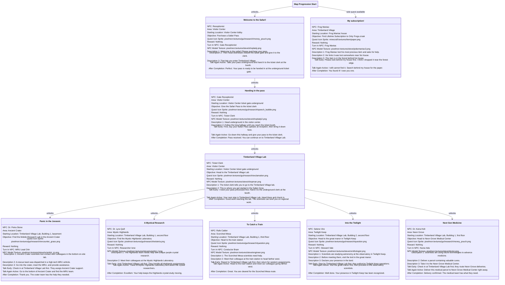

```mermaid
%%{init: {"class": {"hideEmptyMembersBox": true}} }%%
classDiagram

class MapProgressionStart["Map Progression Start"]

class WelcomeToTheSafari["Welcome to the Safari!"] {
  NPC: Receptionist
  Area: Visitor Center
  Starting Location: Visitor Center lobby
  Objective: Purchase a Safari Pass
  Quest Icon Sprite: pixelmon:textures/gui/research/money_pouch.png
  Reward: Nothing
  Turn In NPC: Gate Receptionist
  NPC Model Texture: pixelmon:textures/steve/shoplady.png
  Description 1: Welcome to the safari! Please purchase your pass.
  Description 2: Then head downstairs toward the safari gate and give it to the clerk.
  Description 3: That lets you enter Timberland Village.
  Talk Again Active: Take your pass underground and hand it to the ticket clerk at the booth.
  After Completion: Perfect. Your pass is ready to be handed in at the underground ticket gate.
}

class HandingInThePass["Handing in the pass"] {
  NPC: Gate Receptionist
  Area: Visitor Center
  Starting Location: Visitor Center ticket gate underground
  Objective: Give the Safari Pass to the ticket clerk
  Quest Icon Sprite: pixelmon:textures/gui/research/speech_bubble.png
  Reward: Nothing
  Turn In NPC: Ticket Clerk
  NPC Model Texture: pixelmon:textures/steve/shoplady2.png
  Description 1: Head underground in the visitor center.
  Description 2: Follow the long hallway until you reach the ticket booth.
  Talk Early: First, buy your Safari Pass upstairs at reception, then bring it down here.
  Talk Again Active: Go down this hallway and give your pass to the ticket clerk.
  After Completion: Pass received. You can continue on to Timberland Village Lab.
}

class TimberlandVillageLab["Timberland Village Lab"] {
  NPC: Ticket Clerk
  Area: Visitor Center
  Starting Location: Visitor Center ticket gate underground
  Objective: Head to the Timberland Village Lab
  Quest Icon Sprite: pixelmon:textures/gui/research/exclamation.png
  Reward: Nothing
  NPC Model Texture: pixelmon:textures/steve/shopman.png
  Description 1: The ticket clerk tells you to go to the Timberland Village lab.
  Description 2: This is where you get started in the Safari Zone.
  Talk Early: I need your pass processed first. Hand it to the underground clerk at the booth.
  Talk Again Active: Your next stop is Timberland Village Lab. Head there and check in.
  After Completion: Good work reaching the lab. The scientists can brief you on regional work.
}

class PanicInTheJurassic["Panic in the Jurassic"] {
  NPC: Dr. Petra Stone
  Area: Ancient Crater
  Starting Location: Timberland Village Lab, Building 1, basement
  Objective: Find the Mobile Research Lab in the Ancient Crater
  Quest Icon Sprite: pixelmon:textures/gui/research/encounter_grass.png
  Reward: Nothing
  Turn In NPC: MRU Lead Orin
  NPC Model Texture: pixelmon:textures/steve/scientist_m.png
  Description 1: Ancient Crater scientists lost contact with colleagues in the bottom on-site lab.
  Description 2: A rescue team was dispatched in a high-tech MRU vehicle.
  Description 3: Go into the crater, meet the MRU, and provide assistance.
  Talk Early: Check in at Timberland Village Lab first. They assign Ancient Crater support.
  Talk Again Active: Go to the bottom of Ancient Crater and find the MRU team.
  After Completion: Thank you. The crater team has the help they needed.
}

class AMysticalResearch["A Mystical Research"] {
  NPC: Dr. Lyra Quill
  Area: Mystic Highlands
  Starting Location: Timberland Village Lab, Building 1, second floor
  Objective: Find the Mystic Highlands Laboratory
  Quest Icon Sprite: pixelmon:textures/gui/research/wisteria.png
  Reward: Nothing
  Turn In NPC: Researcher Ione
  NPC Model Texture: pixelmon:textures/steve/scientist_f.png
  Description 1: The Highlands team needs help with unique purple crystal research.
  Description 2: Meet their colleagues at the Mystic Highlands Laboratory.
  Talk Early: Visit Timberland Village Lab first. They handle all Highlands assignments.
  Talk Again Active: Travel to Mystic Highlands Laboratory and assist the crystal researchers.
  After Completion: Excellent. Your help keeps the Highlands crystal study moving.
}

class ToCatchATrain["To Catch a Train"] {
  NPC: Rafe Calder
  Area: Scorched Mesa
  Starting Location: Timberland Village Lab, Building 1, third floor
  Objective: Head to the train station
  Quest Icon Sprite: pixelmon:textures/gui/research/question.png
  Reward: Nothing
  Turn In NPC: Conductor Bram
  NPC Model Texture: pixelmon:textures/steve/engineer.png
  Description 1: The Scorched Mesa scientists need help.
  Description 2: Meet their colleague at the train station to head farther west.
  Talk Early: Report to Timberland Village Lab first, then return for western assignments.
  Talk Again Active: Head to the train station and meet our colleague going farther west.
  After Completion: Great. You are cleared for the Scorched Mesa route.
}

class IntoTheTwilight["Into the Twilight"] {
  NPC: Selene Vire
  Area: Twilight Keep
  Starting Location: Timberland Village Lab, Building 2, second floor
  Objective: Head to the great manor in Twilight Keep
  Quest Icon Sprite: pixelmon:textures/gui/research/question.png
  Reward: Nothing
  Turn In NPC: Steward Vale
  NPC Model Texture: pixelmon:textures/steve/ornithologist.png
  Description 1: Scientists are studying astronomy at the observatory in Twilight Keep.
  Description 2: Before meeting them, visit the lord in the great manor.
  Description 3: Declare your presence in the land.
  Talk Early: Stop by Timberland Village Lab first; they authorize Twilight Keep operations.
  Talk Again Active: Visit the great manor first, then proceed to the observatory scientists.
  After Completion: Well done. Your presence in Twilight Keep has been recognized.
}

class NextGenMedicine["Next Gen Medicine"] {
  NPC: Dr. Keira Holt
  Area: Neon Grove
  Starting Location: Timberland Village Lab, Building 1, first floor
  Objective: Head to Neon Grove Medical Center
  Quest Icon Sprite: pixelmon:textures/gui/research/money_pouch.png
  Reward: Nothing
  Turn In NPC: Nurse Ada
  NPC Model Texture: pixelmon:textures/steve/doctor.png
  Description 1: Scientists are using future technologies to advance medicine.
  Description 2: Deliver a parcel containing valuable cures.
  Description 3: Take it to the Neon Grove Medical Center.
  Talk Early: Check in at Timberland Village Lab first; they route Neon Grove deliveries.
  Talk Again Active: Deliver this medical parcel to Neon Grove Medical Center right away.
  After Completion: Delivery confirmed. The medical team has what they need.
}

class MySubscription["My subscription!"] {
  NPC: Frog Maniac
  Area: Timberland Village
  Starting Location: Frog Maniac house
  Objective: Find Lifеtimе Subscriрtiоn to Оnly Frоgs.crоаk
  Quest Icon Sprite: minecraft:textures/item/paper.png
  Reward: Nothing
  Turn In NPC: Frog Maniac
  NPC Model Texture: pixelmon:textures/steve/pokemaniac3.png
  Description 1: Frog Maniac lost his most precious item and asks for help.
  Description 2: He hints it was lost somewhere near his house.
  Description 3: The item is in the forest behind his house.
  Talk Early: Please look behind my house first. I think I dropped it near the forest edge.
  Talk Again Active: I still cannot find it. Search behind my house for the paper.
  After Completion: You found it! I owe you one.
}

MapProgressionStart --> WelcomeToTheSafari : unlocks
WelcomeToTheSafari --> HandingInThePass : unlocks
HandingInThePass --> TimberlandVillageLab : unlocks

TimberlandVillageLab --> PanicInTheJurassic : unlocks
TimberlandVillageLab --> AMysticalResearch : unlocks
TimberlandVillageLab --> ToCatchATrain : unlocks
TimberlandVillageLab --> IntoTheTwilight : unlocks
TimberlandVillageLab --> NextGenMedicine : unlocks

MapProgressionStart --> MySubscription : side quest available
```
